<p align="center">
  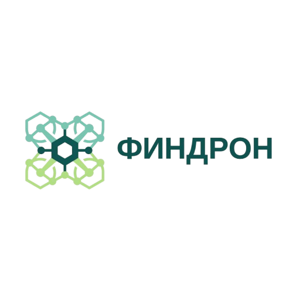
</p>

<h1 align="center">ФинДрон — IT-агрегатор решений для БАС</h1>

<p align="center">
  Vendor-agnostic платформа управления беспилотными авиационными системами
</p>

<p align="center">
  
  
  
  
</p>

---

## Описание

**ООО «ФинДрон»** — IT-агрегатор, специализирующийся на подборе, адаптации и интеграции программных решений для беспилотных авиационных систем (БАС). Компания не является вендором — платформа **ФинДрон HUB** объединяет решения сторонних поставщиков в единую экосистему управления.

Проект разработан в рамках университетской бизнес-игры по моделированию IT-компании в сфере беспилотных систем.

---

## Платформа ФинДрон HUB

Модульная SaaS-платформа управления полным жизненным циклом БАС.

| Модуль | Назначение | Цена/год |
|---|---|---:|
| Управление полётами | Маршруты, координация флота, ФГИС ИВП | 580 000 ₽ |
| Мониторинг и телеметрия | Real-time данные, дашборды, алерты | 520 000 ₽ |
| Нормализация данных | Единый формат, API-шлюз, ETL | 480 000 ₽ |
| Отказоустойчивость | Резервирование каналов, автономные сценарии | 640 000 ₽ |
| Аналитика и отчётность | KPI, прогноз ТО, отчёты для регулятора | 420 000 ₽ |
| Безопасность и комплаенс | Шифрование, IAM, журналирование | 380 000 ₽ |

<p align="center">
  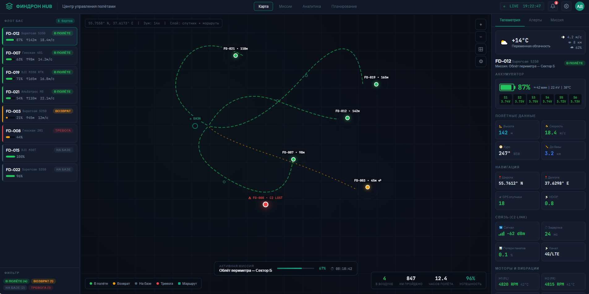
</p>

---

## Техническая архитектура

Архитектура спроектирована для пилотного проекта городской экосистемы беспилотного транспорта в Иннополисе. Подробная документация — [`docs/`](docs/).

```
                    ┌─────────────────────────────────┐
                    │       ФинДрон HUB (ядро)        │
                    │  Агрегационный движок · API-шлюз │
                    └──────────┬──────────────────────┘
                               │
            ┌──────────────────┼──────────────────┐
            │                  │                  │
   ┌────────▼────────┐ ┌──────▼──────┐ ┌─────────▼────────┐
   │  ЦОД            │ │ Телеметрия  │ │ Витрина-         │
   │  Edge + Атомдата│ │ 5G/4G/LoRa  │ │ агрегатор        │
   └─────────────────┘ └─────────────┘ └──────────────────┘
```

**ЦОД:** гибридная модель — 3 Edge-узла (<5 мс) + центральный ЦОД Атомдата (3–8 мс). TCO 3 года: 42–60 млн ₽.

**Телеметрия:** многоканальное резервирование — 5G SA, 4G LTE, LoRaWAN, Wi-Fi 6E, GNSS+RTK (<2 см), спутник LEO.

**Интеграции:** Яндекс Go, ЕДДС-112, ФГИС ИВП, светофорные контроллеры, цифровой двойник Иннополиса.

**ИБ:** TLS 1.3, AES-256, DTLS (C2), MFA, SIEM, ФЗ-152.

---

## Тарифы

| | Старт | Бизнес | Премиум | Enterprise |
|---|:---:|:---:|:---:|:---:|
| **Цена** | 480 ₽ | 890 ₽ | 1 490 ₽ | 490 000 ₽ |
| **Модель** | борт/мес. | борт/мес. | борт/мес. | фикс./мес. |
| **Бортов** | до 10 | до 100 | до 499 | от 500 |
| **Модули** | 3 | 5 | все 6 | 6 + кастом |
| **SLA** | 99.5% | 99.7% | 99.9% | 99.95% |
| **Поддержка** | 8/5 | 12/7 | 24/7 | 24/7 + TAM |

При оплате за год — скидка 20%. Enterprise: фиксированная цена независимо от количества бортов.

---

## Витрина услуг

Интерактивная витрина с калькулятором стоимости: [`ui/findron_services_storefront.html`](ui/findron_services_storefront.html)

<p align="center">
  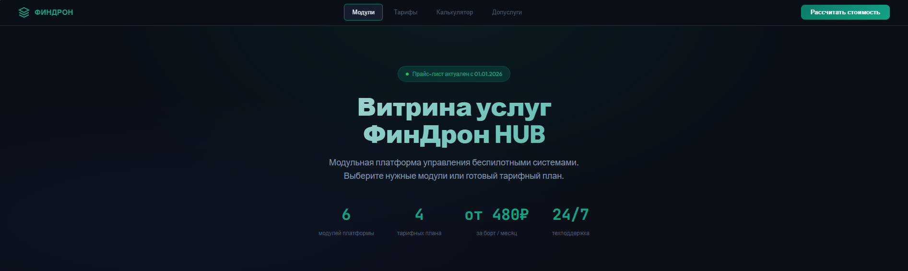
</p>
<p align="center">
  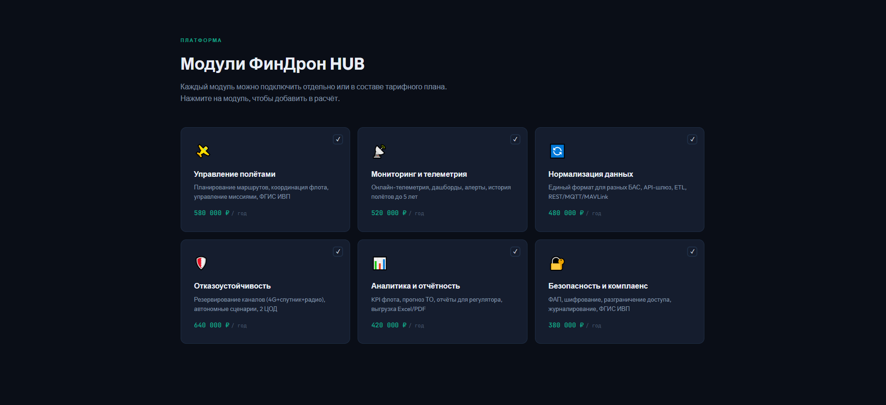
</p>
<p align="center">
  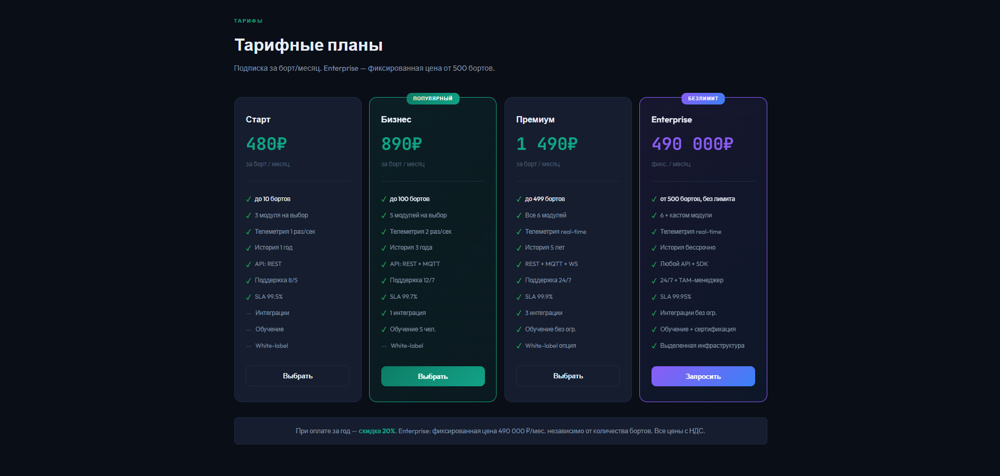
</p>
<p align="center">
  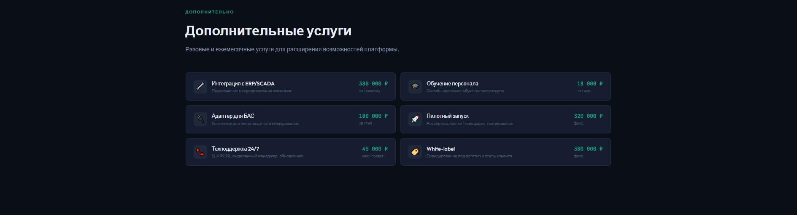
</p>
<p align="center">
  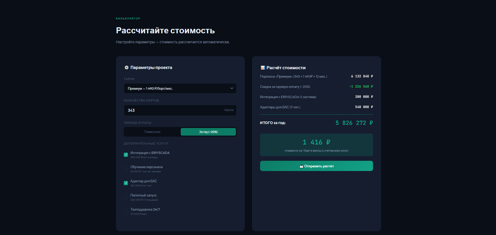
</p>

---

## Финансовые показатели

| Показатель (тыс. ₽) | 2025 | 2024 | 2023 |
|---|---:|---:|---:|
| Выручка | 1 570 020 | 1 207 710 | 760 953 |
| Чистая прибыль | 506 406 | 373 306 | 211 762 |
| Баланс (активы) | 1 167 000 | 859 858 | 348 201 |
| Собственный капитал | 785 094 | 514 688 | 211 772 |

Рентабельность продаж: 32.3% · Рост выручки YoY: +30% · Текущая ликвидность: 2.77

---

## Структура репозитория

```
FIN_Drone/
│
├── assets/
│   ├── logos/                         — логотипы компании и партнёров
│   │   ├── findron.png
│   │   ├── geoscan.png
│   │   ├── supercam.png
│   │   ├── aeromax.png
│   │   └── albatros.png
│   └── screenshots/                   — скриншоты интерфейсов
│       ├── hub_dashboard.png
│       ├── storefront_hero.png
│       ├── storefront_modules.png
│       ├── storefront_pricing.png
│       ├── storefront_addons.png
│       └── storefront_calc.png
│
├── docs/                              — проектная документация
│   ├── Финдрон Корпоративный Профиль.docx
│   ├── Финдрон Корпоративный Профиль.pdf
│   ├── Концепция Игры.docx
│   ├── Глоссарий_Проекта_ИТ-Интегратор.docx
│   └── Роли_Участники.xlsx
│
├── finance/
│   ├── ready/                         — КП к отправке
│   │   ├── Коммерческое_Предложение_WORD.zip
│   │   └── Коммерческое_Предложение_PDF.zip
│   ├── reports/                       — финансовая отчётность
│   │   ├── Отчетности.xlsx
│   │   └── СПАРК_Отчет_ООО_АТИ_СУ_7816397410...
│   └── templates/                     — шаблоны КП и КО
│       ├── Финдрон_КП_Шаблон.docx
│       └── Финдрон_КО_Шаблон.docx
│
├── ui/                                — интерфейсы (HTML)
│   ├── findron_hub.html
│   └── findron_services_storefront.html
│
└── README.md
```

---

## Коммерческие предложения

В архивах `finance/ready/` содержатся 14 персонализированных КП:

<details>
<summary>Развернуть список</summary>

| # | Тип организации | Бюджет проекта |
|---|---|---:|
| 1 | Проектная организация | 3 320 000 ₽ |
| 2 | Дорожно-строительная организация | 4 210 000 ₽ |
| 3 | Электросетевая организация | 5 990 000 ₽ |
| 4 | Оператор мобильной связи | 4 840 000 ₽ |
| 5 | Провайдер кабельных сетей | 3 560 000 ₽ |
| 6 | Банк-экосистема | 7 090 000 ₽ |
| 7 | Агрегатор транспортных услуг | 6 860 000 ₽ |
| 8 | Производитель БАС | 4 640 000 ₽ |
| 9 | Сервисная компания БАС | 4 750 000 ₽ |
| 10 | Эксплуатант БТС | 7 030 000 ₽ |
| 11 | Сеть ресторанов | 4 940 000 ₽ |
| 12 | Продуктовый супермаркет | 4 080 000 ₽ |
| 13 | Электронный маркетплейс | 7 400 000 ₽ |
| 14 | Курьерская служба | 6 060 000 ₽ |

</details>

---

## Технологический стек

| Слой | Технологии |
|---|---|
| Backend | Kubernetes, gRPC, REST API |
| Телеметрия | MQTT, MAVLink, DJI SDK, WebSocket |
| Хранение | PostgreSQL, TimescaleDB, S3 |
| Edge | NVIDIA Jetson AGX Orin, FPGA |
| Связь | 5G SA, 4G, LoRaWAN, Wi-Fi 6E, UWB, LEO VSAT |
| Безопасность | TLS 1.3, AES-256, DTLS, MFA, SIEM |
| Frontend | React, WebSocket |
| Мониторинг | Prometheus, Grafana |

---

## Партнёры

<p align="center">
  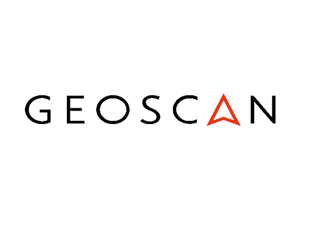
  &nbsp;&nbsp;&nbsp;&nbsp;
  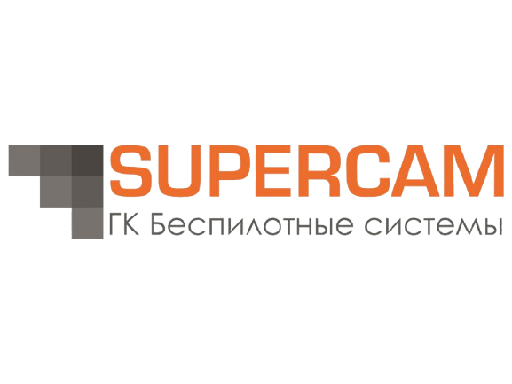
  &nbsp;&nbsp;&nbsp;&nbsp;
  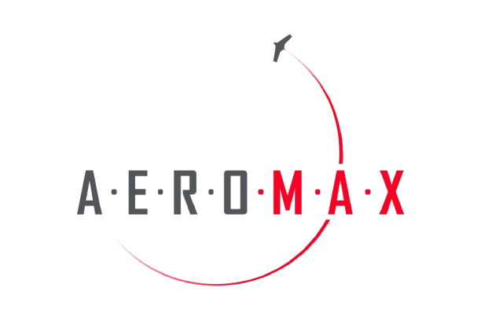
  &nbsp;&nbsp;&nbsp;&nbsp;
  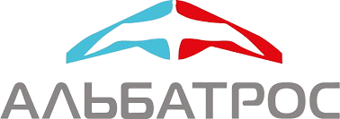
</p>
